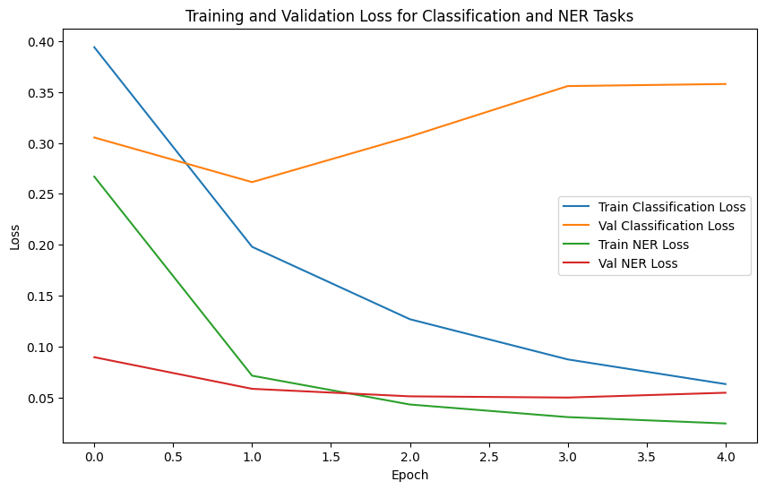

# Multi-Task Sentence Transformer: Implementation & Evaluation

## Overview
This project implements a multi-task sentence transformer that supports two key NLP tasks: sentence classification and named entity recognition (NER). The solution builds upon a pre-trained transformer (["sentence-transformers/all-mpnet-base-v2"](https://huggingface.co/sentence-transformers/all-mpnet-base-v2)) to encode sentences into fixed-length embeddings and then extends the architecture with task-specific heads. Additionally, a complete training loop is provided alongside a Flask web demo for real-time inference.

## Task 1: Sentence Transformer Implementation
### Model Design
- **Base Model:** pre-trained `"sentence-transformers/all-mpnet-base-v2"` model from Hugging Face due to its strong performance in generating high-quality sentence embeddings.
- **Pooling Strategy:** Two pooling strategies were considered:
  - **Mean Pooling:** Computes the average of token embeddings, offering a robust summary of the entire sentence.
  - **CLS Pooling:** Uses the first token's embedding as the sentence representation.
  
  For implementation, **mean pooling** was chosen to capture an aggregate representation over all tokens.   [code.ipynb](code.ipynb) can be modified to test `CLS Pooling`

### Sample Evaluation
The model was tested on several sample sentences, including:
- "Highly intelligent, dogs have the capability of expressing their joy and happiness by wagging their tails."
- "They are known to be the most loyal of animals. Dogs can sense your pain and can be your best friend."

For each sample, the model successfully generated a fixed-length embedding, with the embedding shape confirming the expected dimensions (`torch.Size([1, 768])`).

## Task 2: Multi-Task Learning Expansion
### Architecture Enhancements
The sentence transformer was extended to support two tasks by adding two distinct heads:
- **Task A – Sentence Classification:**  
  - **Objective:** Classify sentences into one of four classes (e.g., World, Sports, Business, Sci/Tech).  
  - **Dataset:** AG News dataset (accessed via Hugging Face datasets) was used, where the label mapping is defined as `{0: "World", 1: "Sports", 2: "Business", 3: "Sci/Tech"}`. This is the original set of labells.
    - Due to the large size of the dataset, only 10% of the official train set was used for training purposes with a 80-20 train-validation split.
  
- **Task B – Named Entity Recognition (NER):**  
  - **Objective:** Perform token-level entity recognition.  
  - **Dataset:** CoNLL2003 dataset was used with a reduced set of NER labels `{0: "O", 1: "PER", 2: "ORG", 3: "LOC", 4: "MISC"}`.
    - Official train and validation data split were used for training and validation.

  
### Implementation Details
- **Shared Components:**  
  The transformer encoder and tokenizer are shared across both tasks.  
- **Task-Specific Heads:**  
  A linear layer for sentence classification aggregates the sentence embedding (obtained via mean pooling) while another linear layer processes the token-level embeddings for NER.
- **Loss Functions:**  
  - **Classification:** Cross-entropy loss.
  - **NER:** Cross-entropy loss with an `ignore_index` (set to -100) to handle padded tokens.

## Task 3: Training Considerations
### Freezing Strategies & Transfer Learning

1. **Freezing the Entire Network:**  
   - **Pros:** Leverages pre-trained features entirely; minimal computational cost.
   - **Cons:** No task-specific fine-tuning; might not capture nuances of new tasks.

2. **Freezing Only the Transformer Backbone:**  
   - **Pros:** Keeps robust pre-trained language representations intact while fine-tuning task-specific heads.
   - **Cons:** Limits potential improvements that could be gained by adjusting the deeper layers for specific tasks.

3. **Freezing One of the Task-Specific Heads:**  
   - **Scenario:** When one task (e.g., classification) has a large, high-quality dataset and the other (e.g., NER) is limited.
   - **Pros:** Allows the model to specialize on the weaker task while preserving a strong head on the well-represented task.

### Transfer Learning Process
- **Pre-trained Model:**  
  The `"all-mpnet-base-v2"` model was selected because it produces robust semantic embeddings.
- **Layer Adjustments:**  
  Initially, the transformer backbone is frozen and only the classification and NER heads are trained. If performance plateaus, selective unfreezing of the later transformer layers is considered.
- **Rationale:**  
  This approach strikes a balance between leveraging pre-trained language understanding and adapting to task-specific nuances.

## Task 4: Training Loop Implementation (BONUS)
### Training Loop Design
The training loop alternates between the two tasks to ensure balanced updates:
- **Dataset Handling:**  
  - **AG News Dataset:** A subset (10% of the training data) was used with an 80/20 train/validation split.
    - *Dataset size:*
        - Training set size: 9600
        - Validation set size: 2400
  - **CoNLL2003 NER Dataset:** Loaded with tokenization adjustments to align subword tokens with reduced label mappings.
    - *Dataset size:*
        - Training set size: 14041
        - Validation set size: 3250
- **Forward Pass:**  
  - For **classification**, sentences are tokenized and mean pooled to generate a single embedding per sentence.
  - For **NER**, token-level embeddings are processed to generate predictions for each token.
- **Loss Computation:**  
  Both classification and NER losses are computed separately and summed for backpropagation.
- **Mixed Precision Training:**  
  Utilized `torch.cuda.amp` with a gradient scaler to optimize GPU usage and stability during training.
- **Metrics:**  
  - **Classification:** Evaluated using accuracy (via sklearn’s `accuracy_score`).
  - **NER:** Token-level accuracy computed by comparing predictions against true labels (ignoring special tokens).

### Results
- **AG News Test Accuracy:** The model achieved a test accuracy of **92.11 %** on the AG News official test dataset split.
- **CoNLL2003 NER Test Token Accuracy:** The token accuracy for NER was approximately **97.90 %**.
- **Visualization:**  
    
- **Checkpointing:** Early stopping was implemented with patience ( of 3 epochs) to save the best model based on validation loss.

## Demo Application
A simple Flask-based web application was developed for demonstration purposes. Users can:
- **Classify Sentences:** Get predictions for the sentence classification task.
- **Perform NER:** View token-level entity predictions.
- **Display Embeddings:** See the fixed-length sentence embeddings along with the corresponding padding mask.

Please follow [Instruction to build and run docker image](readme.md#instruction-to-build-and-run-docker-image) to run the demo.

## Conclusion & Future Directions
- **Key Decisions:**  
  The decision to use a shared transformer backbone with task-specific heads allowed for efficient multi-task learning. The chosen freezing strategies and transfer learning approach helped balance computational efficiency with task performance.
- **Insights:**  
  - Pre-trained models like `"all-mpnet-base-v2"` offer powerful representations that benefit diverse NLP tasks.
  - Alternating between tasks in the training loop supports balanced learning across tasks.
- **Future Work:**  
  Potential next steps include exploring dynamic task weighting, experimenting with alternative pooling strategies, and expanding the dataset size for further improvements.

## Environment Setup
The repository includes a `requirements.txt` file for environment replication. Additionally, the project has been containerized using Docker to streamline deployment and testing.

---

Feel free to reach out if you need additional details or further clarifications on any part of the implementation.
